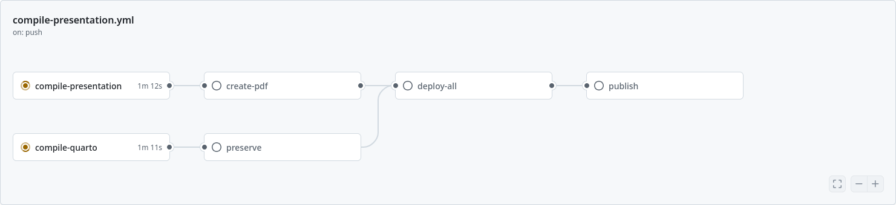

# Tutorial

## Follow along


## To set this up

You may need an `.Renviron` file in the root of the project with the following content:

```
QUALTRICS_API_KEY='something here'
QUALTRICS_BASE_URL='XXXX.qualtrics.com'
DATAVERSE_TOKEN='somethingelse'
DATAVERSE_SERVER='https://demo.dataverse.org'
DATAVERSE_DATASET_DOI='doi:10.70122/xxx/xxxxx'
```

where you should replace this with the true values. See the [Qualtrics API documentation](https://www.qualtrics.com/support/integrations/api-integration/overview/) for more information. For Dataverse uploader, see <https://github.com/IQSS/dataverse-uploader>.

You should then set the GH Actions secrets with

```
gh secret set -f .Renviron
```

If you need to work in Codespaces, you will also need to add this to your Codespace secrets:

```
gh secret set -f .Renviron --user $GITHUB_REPOSITORY
```

then go to <https://github.com/settings/codespaces> and enable them for this repository (if not already done).

## Testing the Quarto build locally

You can reproduce the GitHub Actions build on your own machine using the same
`rocker/verse` container that the project is based on (see [Dockerfile](./Dockerfile)).
The R packages are managed by [`renv`](https://rstudio.github.io/renv/); the project
library lives under `renv/library` as symlinks into the renv cache in `.cache`, so
**both** the project directory and `.cache` must be mounted into the container.

### Headless render (CI equivalent)

From the root of the repository, render the landing page and the presentation exactly
as the workflow does:

```bash
docker run --rm \
  --user 1000:rstudio \
  -e DISABLE_AUTH=true \
  -v "$PWD":/home/rstudio/project \
  -v "$PWD/.cache":/home/rstudio/.cache \
  -w /home/rstudio/project \
  --entrypoint /bin/bash \
  rocker/verse:4.4.1 \
  -c "quarto render index.qmd --output-dir _html && quarto render presentation/index.qmd --output-dir _html"
```

The rendered output is written to `_html/` (the presentation lands in
`_html/presentation/index.html`). R automatically reads secrets from the `.Renviron`
file in the project root (see below); if `QUALTRICS_API_KEY` is not set, the survey
data chunks degrade gracefully and render empty tables, which is sufficient for testing
the build itself.

> The presentation now assembles its slides with Quarto's
> `` shortcode rather than the older knitr `child=` chunks. Include
> paths are relative to `presentation/index.qmd`, so the shared
> `00-survey-config.Rmd` at the repository root is referenced as
> ``.

### Interactive RStudio session

To poke at the project interactively (e.g. to debug a chunk), use the helper script,
which mounts the project and `.cache` and starts RStudio Server on
<http://localhost:8787>:

```bash
./run-interactive.sh
```

## Github Actions workflow

The following is approximately the workflow:


