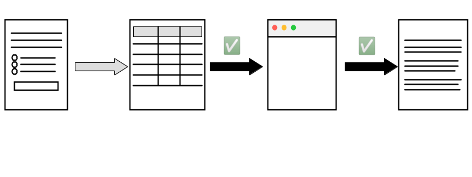
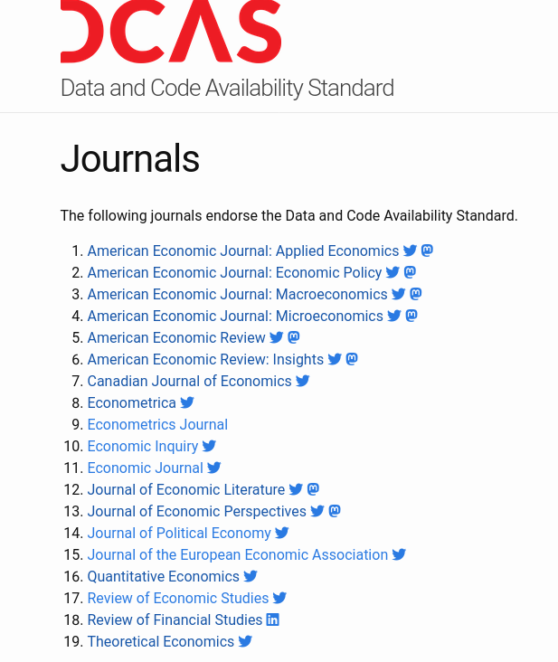
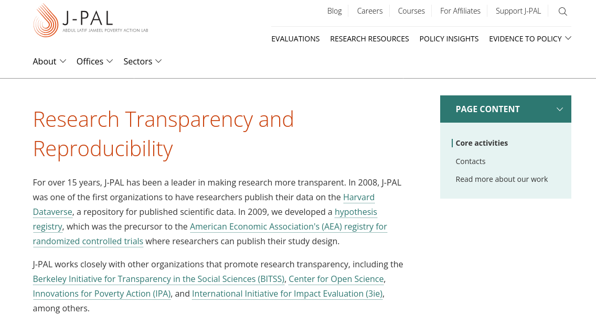

## Verifying transparency in academia

::: {.white-col}

:::

## Verification by journals

- **Provision** (publication of materials) provides transparency
- **Verification** (running the analysis again - computational reproducibility) compensates for *mistrust*/*absence of trust*

## Which journals  {.smaller}

::::{.columns}
:::{.column width="50%"}

- [American Economic Association](https://www.aeaweb.org/journals/) (8)
- [Econometric Society](https://www.econometricsociety.org/) (3)
- [Canadian Journal of Economics](https://www.economics.ca/cje-home) (1)
- [Royal Economic Society](https://res.org.uk/journals/) (2)
- [Western Economic Association International](https://weai.org/view/EI-Journal-Policies) (1)
- [European Economic Association](http://www.eeassoc.org/journal) (1)
- [Review of Economic Studies](https://www.restud.com/) (1)
- [Journal of the European Economic Association](https://academic.oup.com/jeea) (1)
- [Journal of Political Economy](https://www.journals.uchicago.edu/journals/jpe/about) (3)
- [American Journal of Political Science](https://onlinelibrary.wiley.com/page/journal/15405907/) (1)
- [American Political Science Review](https://www.cambridge.org/core/journals/american-political-science-review) (1)

:::
:::{.column width="50%"}

:::
::::

## Verification by others

::::{.columns}
:::{.column width="50%"}

- Pre-publication: [cascad](https://www.cascad.tech/)

:::
:::{.column width="50%"}

- Post-publication: [Data Colada](https://datacolada.org/), [Institute for Replication](https://i4replication.org/)

:::
::::

## Verification by institutions

::::{.columns}
:::{.column width="50%"}

- [World Bank](https://reproducibility.worldbank.org/index.php/home)

![World Bank RRR[^jones]](images/worldbank-rrr.png)

[^jones]: Jones, M. (2024). Introducing Reproducible Research Standards at the World Bank. Harvard Data Science Review, 6(4). <https://doi.org/10.1162/99608f92.21328ce3>

:::
:::{.column width="50%"}

:::
::::
