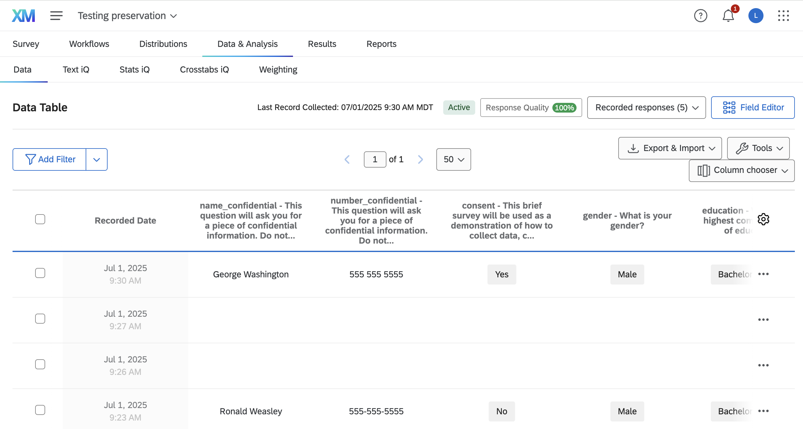
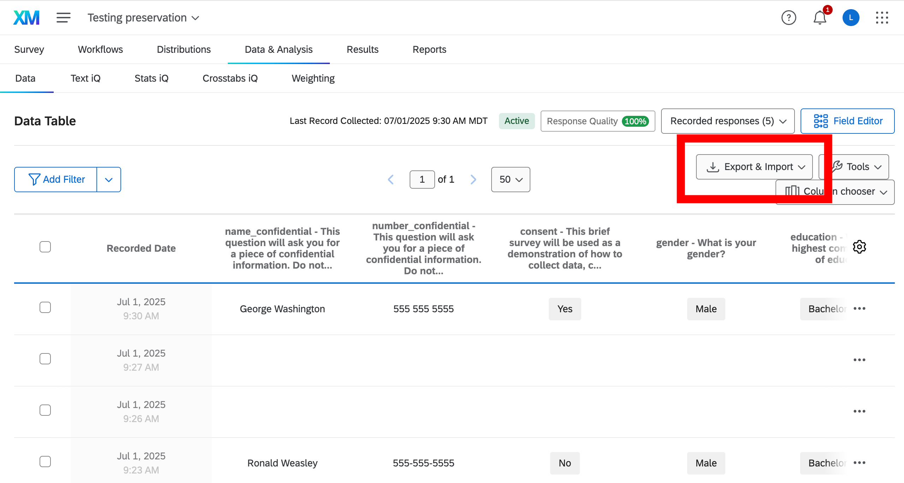
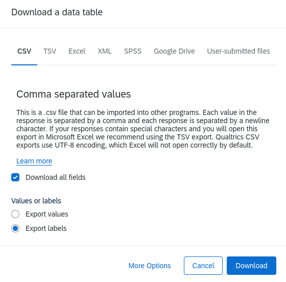

## Survey responses in Qualtrics

::: {.columns}

:::: {.column width="50%"}

Responses can be easily checked at a glance in the `Data and Analytics` tab. [🔒](`r file.path(QUALTRICS_FULL_URL,"responses/#/surveys", QUALTRICS_SURVEY)`)

::::

:::: {.column width="50%"}



::::
:::

## Downloading data

::: {.columns}

:::: {.column width="50%"}

You can download data directly from this page

- If you do this only once, downloading manually is fine.
- Do it 2-3 times, you *may* want to program it!

::::
:::: {.column width="50%"}



::::
:::


## Download options

::: {.columns}

:::: {.column width="50%"}

You can download data directly from this page

- Do it 2-3 times, you *may* want to program it!

::::
:::: {.column width="50%"}



::::
:::

## Downloaded data

The data downloaded depends on parameters chosen. For instance, downloading as CSV with default settings yields

```{.csv}
StartDate,EndDate,Status,Progress,Duration (in seconds),Finished,RecordedDate,ResponseId,DistributionChannel,UserLanguage,consent,age_1,gender,education,num_tabs_1,name_confidential,number_confidential
Start Date,End Date,Response Type,Progress,Duration (in seconds),Finished,Recorded Date,Response ID,Distribution Channel,User Language,"This brief survey will be used as a demonstration of how to collect data, clean the data and remove any confidential information, and publish the data. The information collected is entirely anonymous. It will be used as part of the tutorial for educational purposes. By continuing, you agree that the data you enter will be stored and used for these purposes. You do not need to fill out this information in order to participate in the tutorial. At any point you can choose to stop participating in the survey or not answer any question. Do you consent to participating in this survey?",What is your age? - Age (years),What is your gender?,What is your highest completed level of education?,"On your computer currently, how many open browser tabs do you have? - Number of tabs","This question will ask you for a piece of confidential information. Do not respond with a true answer, but instead make up a response. Question: what is your name?","This question will ask you for a piece of confidential information. Do not respond with a true answer, but instead make up a response. Question: what is your phone number?"
"{""ImportId"":""startDate"",""timeZone"":""America/New_York""}","{""ImportId"":""endDate"",""timeZone"":""America/New_York""}","{""ImportId"":""status""}","{""ImportId"":""progress""}","{""ImportId"":""duration""}","{""ImportId"":""finished""}","{""ImportId"":""recordedDate"",""timeZone"":""America/New_York""}","{""ImportId"":""_recordId""}","{""ImportId"":""distributionChannel""}","{""ImportId"":""userLanguage""}","{""ImportId"":""QID1""}","{""ImportId"":""QID2_1""}","{""ImportId"":""QID3""}","{""ImportId"":""QID4""}","{""ImportId"":""QID5_1""}","{""ImportId"":""QID6_TEXT""}","{""ImportId"":""QID7_TEXT""}"
2025-07-01 11:13:44,2025-07-01 11:14:18,IP Address,100,34,True,2025-07-01 11:14:19,R_5rYfeErcBsS3nsJ,anonymous,EN,Yes,24,Female,Master's degree,3,Harry Potter,555-555-5555
2025-07-01 11:23:01,2025-07-01 11:23:28,IP Address,100,26,True,2025-07-01 11:23:28,R_5rHTV2kfYGjFPep,anonymous,EN,No,21,Male,Bachelor's degree,11,Ronald Weasley,555-555-5555
```