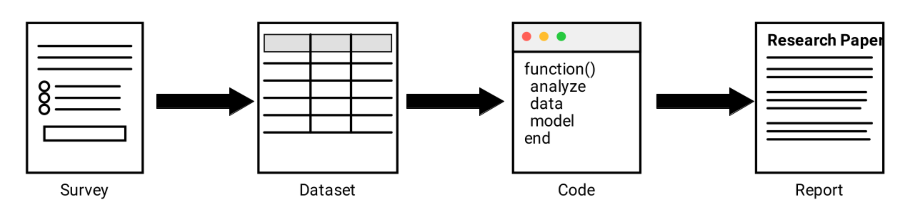
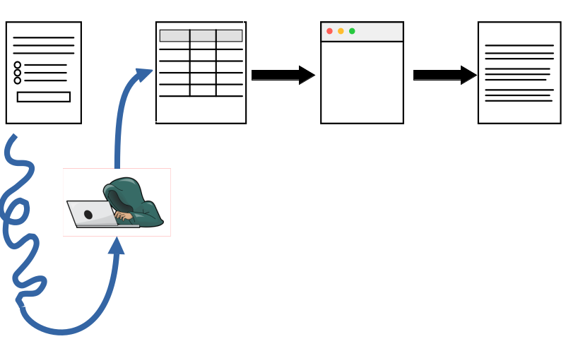

## Stepping up the process

- API, 
- checksums, 
- trusted systems
- preservation

## Credibility of the data flow

::: {.white-col}

:::

## What could go wrong? {.orange}

::: {.smaller}

:::

## How to CERTIFY the full process?

::: {.white-col}

:::

## Taking it a step further

- Survey tool provider (Qualtrics, etc.) exports data, posts checksum
- Survey tool provider exports data only to institution directly into trusted repository, researchers obtain data from there (with privacy protections)
- Has been discussed by authors behind Data Colada
- Don't hold your breath...

