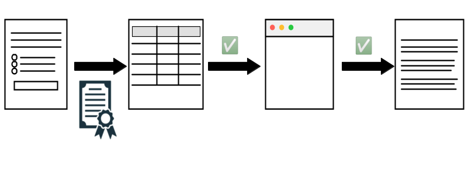
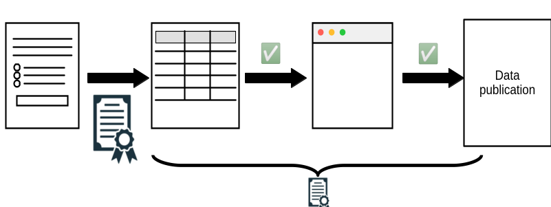

## Taking it a step further

::: {.white-col}

:::

## Taking it a step further

- Has been discussed by authors behind Data Colada
- Survey tool provider (Qualtrics, etc.) exports data, posts checksum
- Survey tool provider exports data only to institution directly into trusted repository, researchers obtain data from there (with privacy protections)

## How to document the full process?

::: {.white-col}

:::
