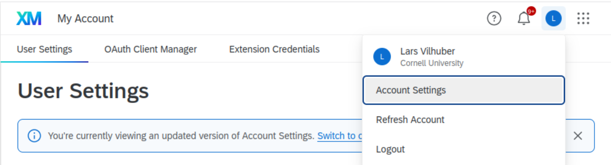
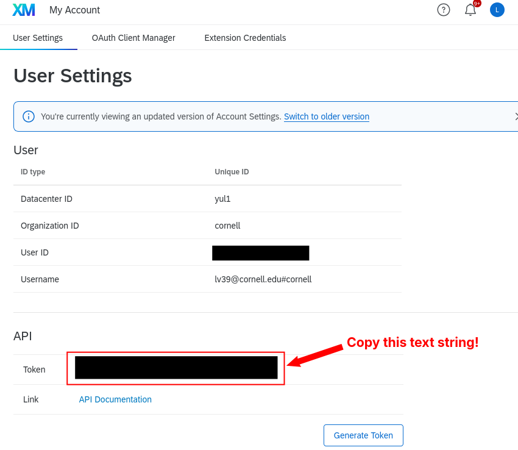

## Qualtrics and API tokens.

An API token is assigned to your **Qualtrics account**. Where do you find it?

:::: {.columns}

::: {.column width="50%"}



:::
::: {.column width="50%"}



:::
::::

## Setting API tokens

> Not specific to the Qualtrics API!


- Set it manually: 

```{.R}
Sys.setenv(QUALTRICS_API_KEY = "ab7ece8b")
```

- Set it using environment variables stored outside your code (e.g., in `.Renviron` file) - *good for testing*
	 
```{.R}
# This is .Renviron
QUALTRICS_API_KEY="ab7ece8b"
```


## Setting API tokens

We want to automate on cloud servers!

- Push these "*secrets*" to `GitHub Secrets`  and load it in `GitHub Actions` [[link](https://docs.github.com/en/actions/how-tos/write-workflows/choose-what-workflows-do/use-secrets)]

## Using API tokens

Now we need to make it available to our code (regardless of where it comes from)

```{.R}
# Here environment variables are read from .Renviron
QUALTRICS_API_KEY <- Sys.getenv("QUALTRICS_API_KEY")
```

## Full code

Now this works both *locally* and on *cloud servers* without any manual interaction!

```{.R}
QUALTRICS_FULL_URL <- "first part of survey URL"
QUALTRICS_SURVEY <- "second part of survey URL, usually starts with SV"

if (Sys.getenv("QUALTRICS_API_KEY") != "") {
  data.raw <- fetch_survey(surveyID = QUALTRICS_SURVEY, verbose = TRUE) 
} else {
  stop("Please set the QUALTRICS_API_KEY environment 
  variable to your API key.")
}
```