## Credibility of Survey Data

::: {.columns-2}

:::: {.column}

- You run a study using the *PSID*. Do you **trust** the downloaded data?

::::
:::: {.column}

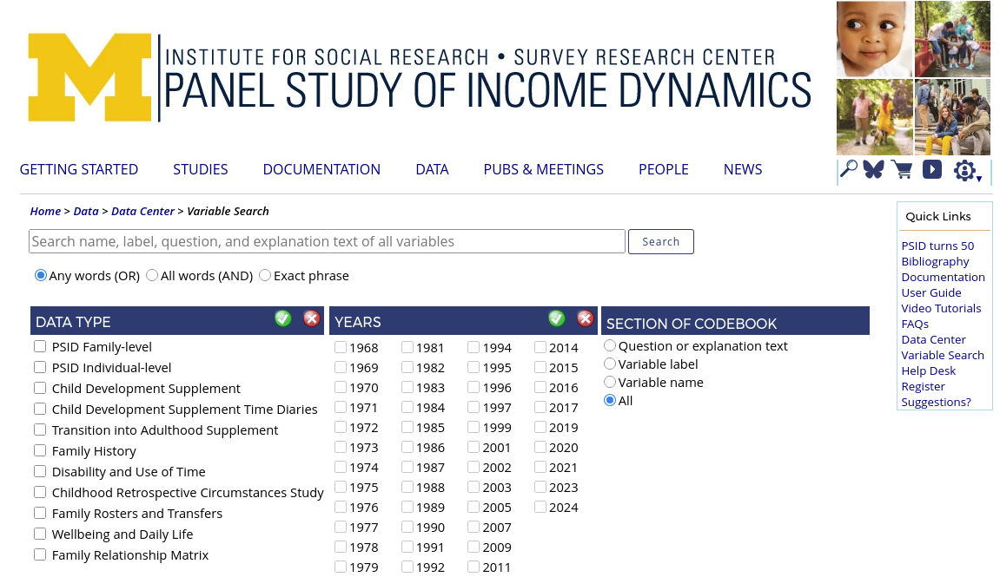

::::
:::

## Credibility of Government Data { transition="fade" }

::: {.columns-2}

:::: {.column}

- You run a study using the PSID. Do you trust the downloaded data?
- You use unemployment data for **Angola** through *World Bank Data Bank*. Do you **trust** the downloaded data?
::::
:::: {.column}

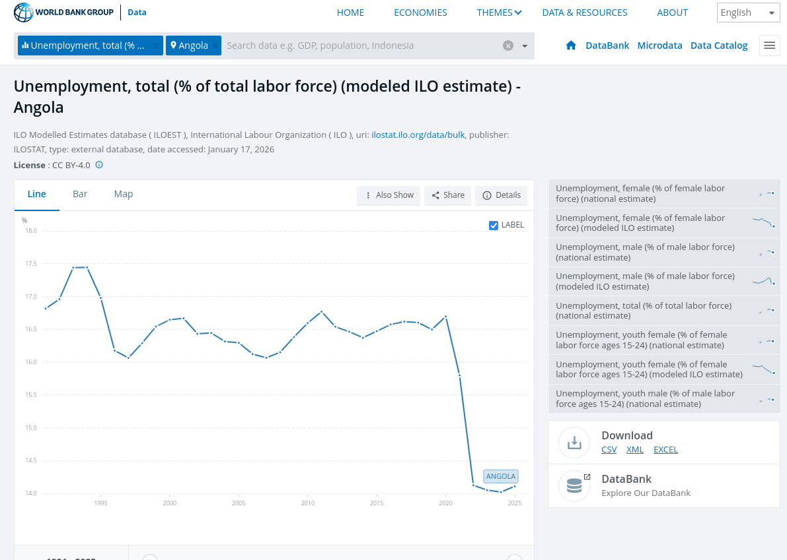

::::
:::

## Credibility of Government Data { transition="fade" }

::: {.columns-2}

:::: {.column}

- You run a study using the PSID. Do you trust the downloaded data?
- You use unemployment data for **Argentina** through World Bank Data Bank. Do you **trust** the downloaded data?
::::
:::: {.column}

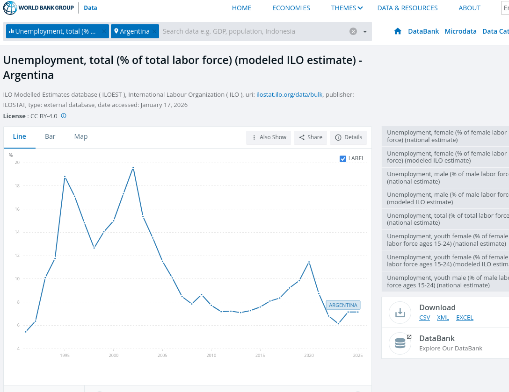

::::
:::

## Credibility of Government Data { transition="fade" }

::: {.columns-2}

:::: {.column}

- You run a study using the PSID. Do you trust the downloaded data?
- You use unemployment data for **United States** through World Bank Data Bank. Do you **trust** the downloaded data?
::::
:::: {.column}


::::
:::


## Credibility of Researcher provided data

::: {.columns-2}

:::: {.column}

- You run a study using the PSID. Do you trust the downloaded data?
- You use inflation data for *Argentina* through a **research deposit on Dataverse**. Do you **trust** the downloaded data?
::::
:::: {.column}

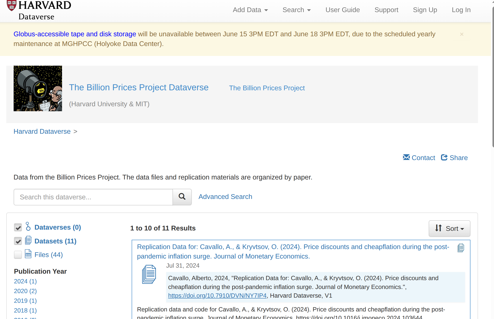

::::
:::

## Let's make you become a mini-PSID {.orange}


## Timing

::: {.columns-2}

:::: {.column}


Once you have registered your analysis plan
- should the **processing and analysis** really change?


Once you have **collected** the data
- is it really going to change?

::::

:::: {.column}

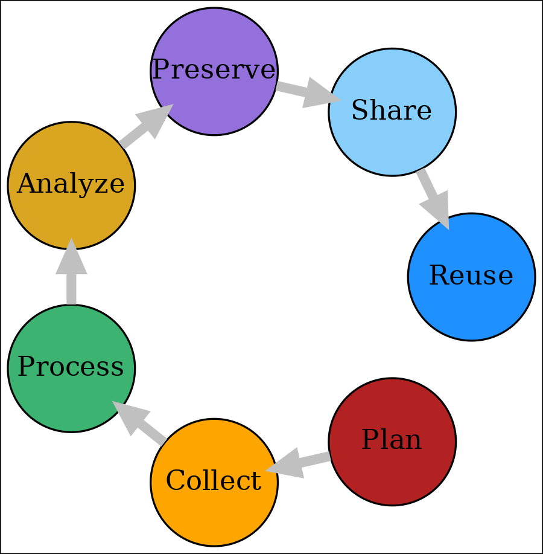

::::

:::

## Modified Data and Workflow { transition="fade" }

::: {.columns-2}

:::: {.column}


Let's consider the preservation part separately:

::::

:::: {.column}

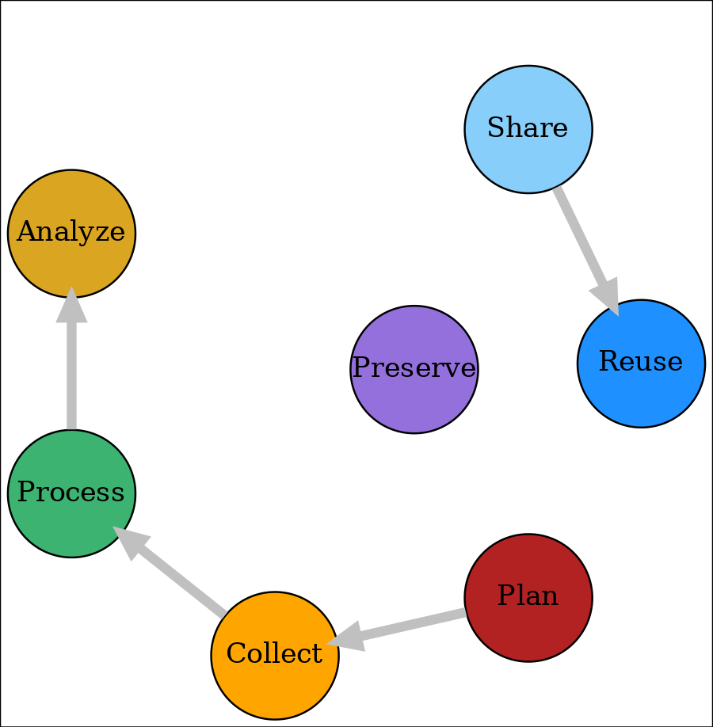

::::

:::


## Modified Data and Workflow { transition="fade" }

::: {.columns-2}

:::: {.column}

Proposal: 

- Preserve as you go

::::

:::: {.column}


::::

:::

## Modified Data and Workflow { transition="fade" }

::: {.columns-2}

:::: {.column}

Proposal: 

- Preserve as you go
- Use what you preserve

::::

:::: {.column}

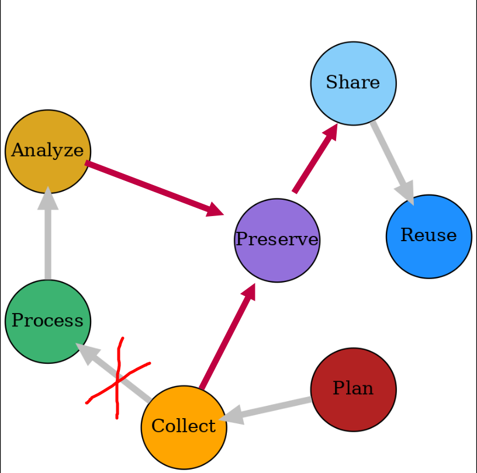

::::

:::

## Modified Data and Workflow { transition="fade" }

::: {.columns-2}

:::: {.column}

Proposal: 

- Preserve as you go
- Use what you preserve

::::

:::: {.column}

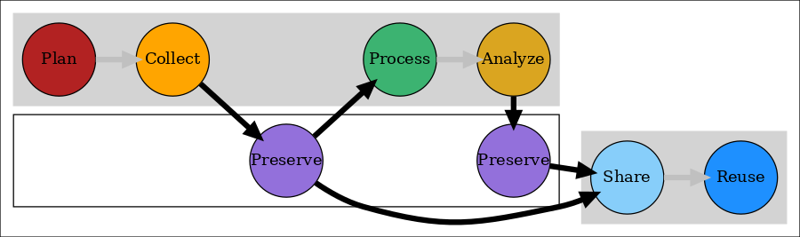

::::

:::

## Note: Doubtful ethics of others... {.orange}

## I don't want to be scooped! {.orange}

<div style="text-align: center; font-size: 200%;">
Thus, I'm not going to publish my raw data just yet!
</div>


## What is preservation

## Preservation {.smaller}

::: {.columns-2}

:::: {.column}

- Preservation != **publication**, != *sharing*
- In fact, preservation may mean: *not very accessible* at all!
- Preservation is intended to maintain data for tens, even hundreds of years
  - Preservation may involve curation: active transformation of the data for improved accessibility
  
::::

:::: {.column}


::::

:::
  
## What is publication


**Publication** typically involves making information about the data, as well as the data themselves, available to others.

- Publication can initially mean that only **metadata** (information about the data) is published
- In some cases, it may be that **only** metadata is ever published
- But the metadata will point to how to access the data, how long the data will be preserved, and other salient facts


## This all seems so complicated

- I need to preserve my data for decades!
- I need to manage the application process for decades!
- Where do I get that DOI thing?
- How to I get Google to index my data?


## Options for Preservation (1)


**Trusted Repositories**

Journals and institutions have assessed a number of trusted repositories:

- [CoreTrustSeal](https://www.coretrustseal.org/) has a certification process
- [re3data.org](https://www.re3data.org/) lists research data repositories
- [Nature](https://www.nature.com/sdata/policies/repositories), [F1000Research](https://f1000research.com/for-authors/data-guidelines#hosting), and [PLOS](https://journals.plos.org/plosone/s/data-availability) have lists of trusted repositories. 
- Always check with your journal for specific restrictions or suggestions.

## Options for Preservation (2) {.smaller}

**Trusted Repositories**

- These generally include at least the following:

  -  [Dryad Digital Repository](http://datadryad.org/)
  -  [figshare](http://figshare.com/)
  -  [Harvard Dataverse](https://dataverse.harvard.edu)
  -  [ICPSR](https://www.icpsr.umich.edu/icpsrweb/) and [OPENICPSR](https://www.openicpsr.org/openicpsr/)
  -  [Open Science Framework](http://osf.io/)
  -  [Zenodo](http://zenodo.org/)
  - Country or region-specific repositories (that nevertheless generally accept depositors from anywhere): [GESIS](https://datorium.gesis.org/xmlui/) (Germany), [Swedish National Data Service (SND)](https://snd.gu.se/en/describe-and-deposit-data), [EASY](https://easy.dans.knaw.nl/ui/home) (Netherlands), [CSIRO](https://data.csiro.au/collections/) (Australia), etc.
- Many universities have formal document repositories that may be able to assume such a role; talk to your (data) librarian

## What are NOT options for preservation

::: {.columns-2}

:::: {.column}

- Github, Gitlab, Bitbucket, etc.
- Dropbox, Box.com, Google Drive, etc.
- Your personal website
- Your university's departmental website

::::

:::: {.column}

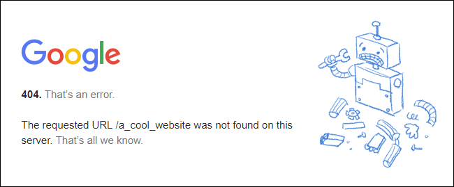

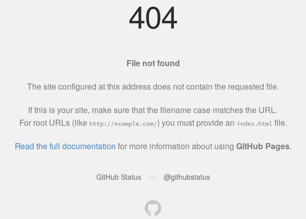

::::

:::

## Options for Preservation

::: {.columns}

:::: {.column width="50%"}

In one of my day jobs:


::::

:::: {.column width="50%"}

::::

:::

## Options for Preservation with API

::: {.columns}

:::: {.column width="50%"}

Dataverse <https://demo.dataverse.org/dataverse/larstest>

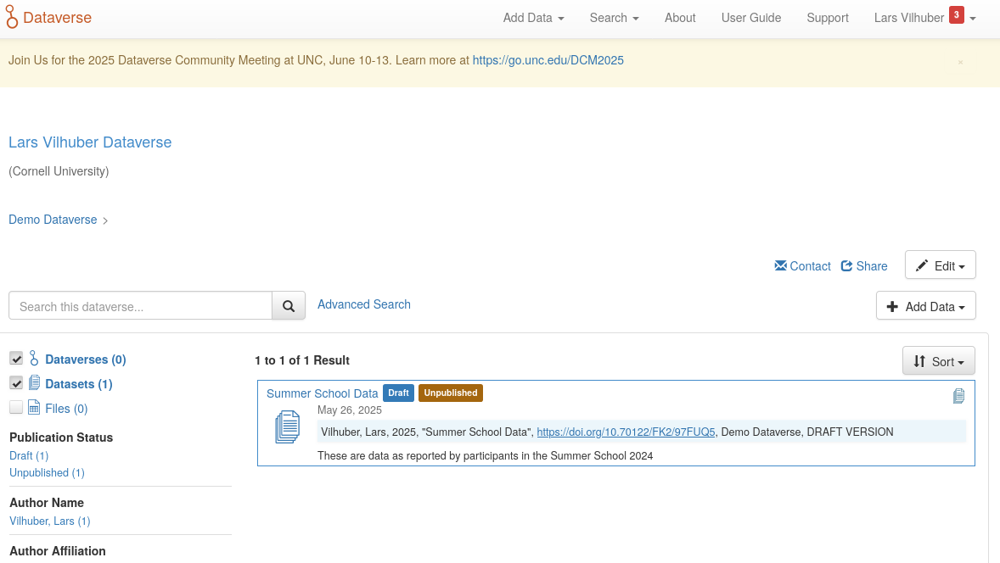

::::

:::: {.column width="50%"}

Also Zenodo <https://zenodo.org>

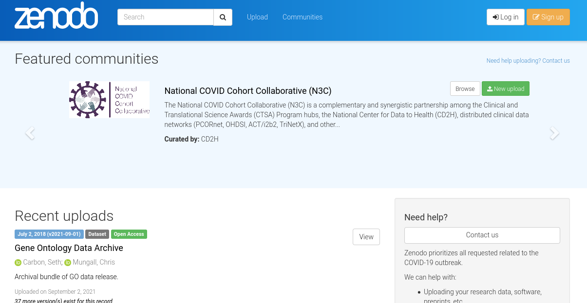

::::

:::

## Getting started on Dataverse

We will NOT use the regular Dataverse; rather, we will test on the demo site. 

- This also works with Zenodo: **<https://sandbox.zenodo.org/>**
- Check your URL bar! There's often no other indication that this is not the real Zenodo or Dataverse!


## A tutorial of sorts

- Demo Dataverse for Lars <https://demo.dataverse.org/dataverse/larstest>

## Remember the API tokens?


```{.bash code-line-numbers="3-5"}
QUALTRICS_API_KEY='something here'
QUALTRICS_BASE_URL='url goes here'
DATAVERSE_TOKEN='token goes here'
DATAVERSE_SERVER='https://demo.dataverse.org'
DATAVERSE_DATASET_DOI='doi goes here'
```

We're going to need the last three here!

## Getting your API keys from Dataverse

:::: {.columns}

::: {.column width="50%"}

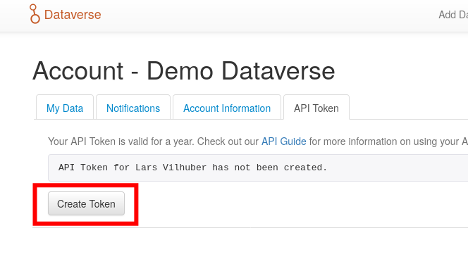

:::
::: {.column width="50%"}

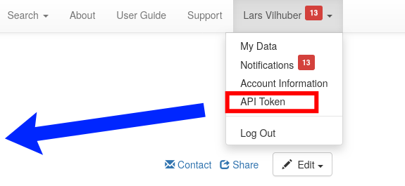

:::
::::

## Adding your API key to your `.Renviron`

:::: {.columns}

::: {.column width="50%"}

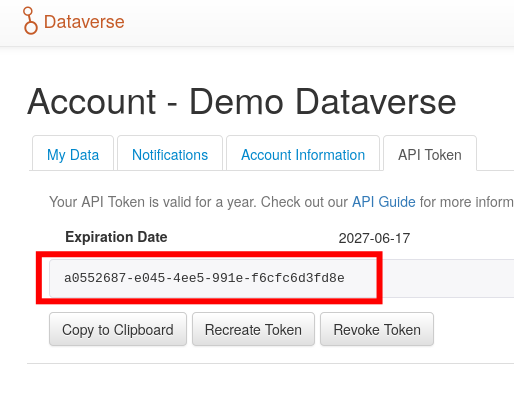

:::
::: {.column width="50%"}

```{.bash code-line-numbers="3"}
QUALTRICS_API_KEY='something here'
QUALTRICS_BASE_URL='url goes here'
DATAVERSE_TOKEN='token goes here'
DATAVERSE_SERVER='https://demo.dataverse.org'
DATAVERSE_DATASET_DOI='doi goes here'
```
:::
::::

## We need a "container"

:::: {.columns}

::: {.column width="50%"}

- Dataverse calls this a "dataset".
- A "dataset" can hold multiple files.
- While this *can be created* via the API, I suggest doing it **manually** (once per project)

:::
::: {.column width="50%"}

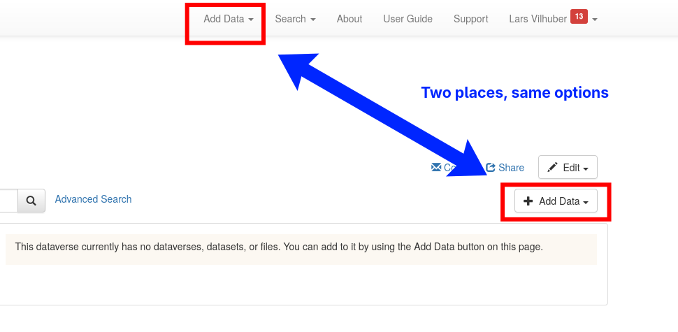

:::
::::

## Fill in metadata

:::: {.columns}

::: {.column width="50%"}

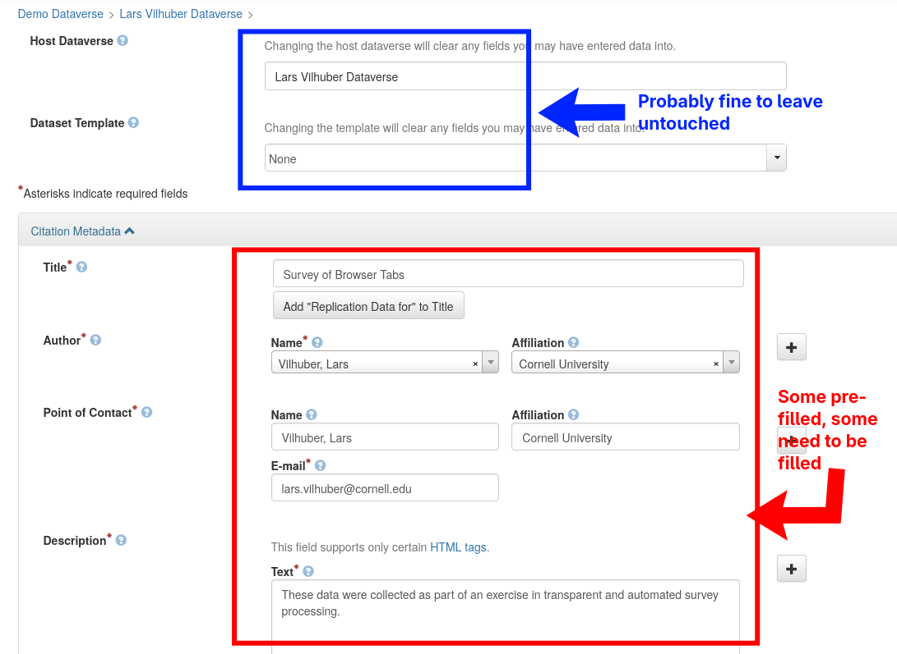

:::
::: {.column width="50%"}

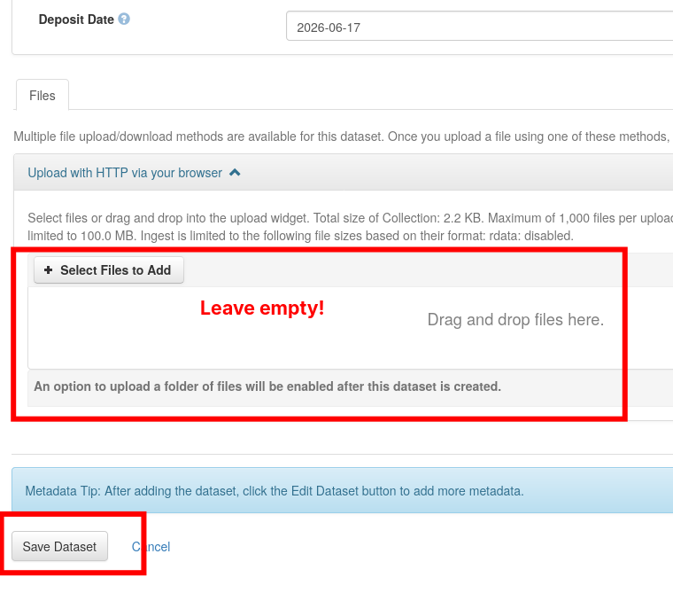

:::
::::

## Uploading data to Dataverse

- You *could* upload data manually, but this is about automation!
- Now that the "container" is ready, we can upload data to it via the API.

## Getting the Identifiers

:::: {.columns}

::: {.column width="50%"}


```{.bash code-line-numbers="5"}
QUALTRICS_API_KEY='something here'
QUALTRICS_BASE_URL='url goes here'
DATAVERSE_TOKEN='token goes here'
DATAVERSE_SERVER='https://demo.dataverse.org'
DATAVERSE_DATASET_DOI='doi goes here'
```

:::
::: {.column width="50%"}

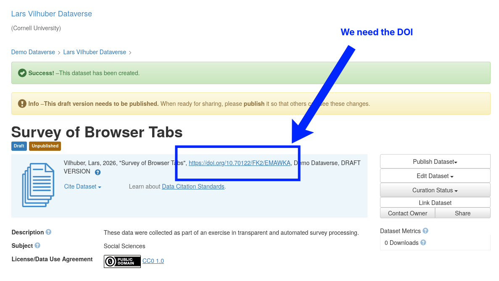

:::

::::

## Additional controls

:::: {.columns}

::: {.column width="50%"}

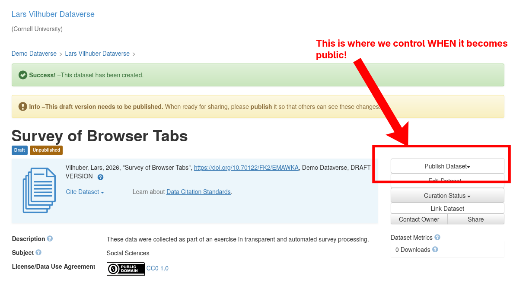

:::
::: {.column width="50%"}

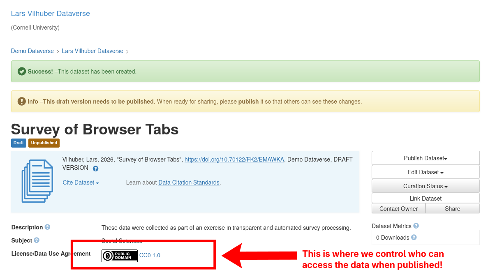

:::
::::

## Licensing and permissions

:::: {.columns}

::: {.column width="50%"}

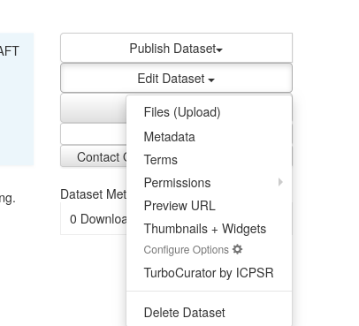

:::

::: {.column width="50%"}

- **Terms**: For people who wish to download published files
- *Permissions*: For fine-grained access over who can do what before publication

:::
::::

## Permissions

:::: {.columns}

::: {.column width="50%"}

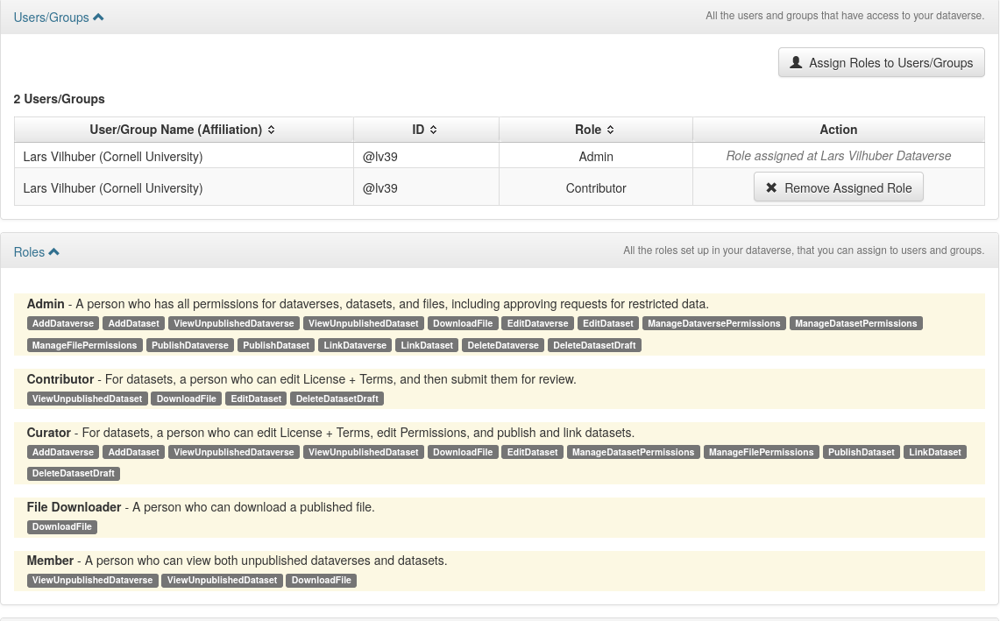

:::

::: {.column width="50%"}

You can designate

- who can upload
- who can edit metadata
- who can publish

:::
::::

## Terms and Licenses

:::: {.columns}

::: {.column width="50%"}

- **Licenses** are broad permissions on how to re-use
- Often CC-BY, see <https://creativecommons.org/cc-licenses/>
- *Terms* are more restrictive. Do third party data users
  - need to contact somebody
  - need to sign a data use agreement
  - need IRB approval

:::
::: {.column width="50%"}

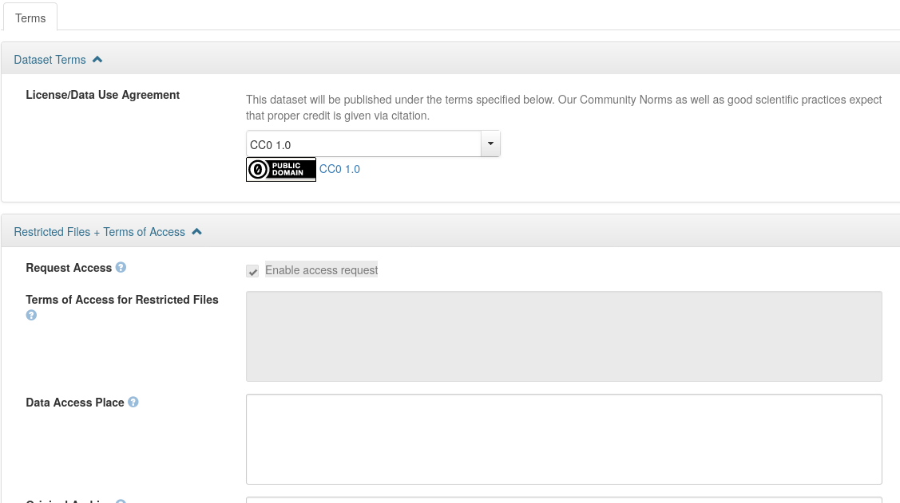

:::
::::

## Terms and Licenses

:::: {.columns}

::: {.column width="50%"}

- You can define custom terms (instead of a standard license)
- Strongly suggest talking with University Counsel!

:::
::: {.column width="50%"}

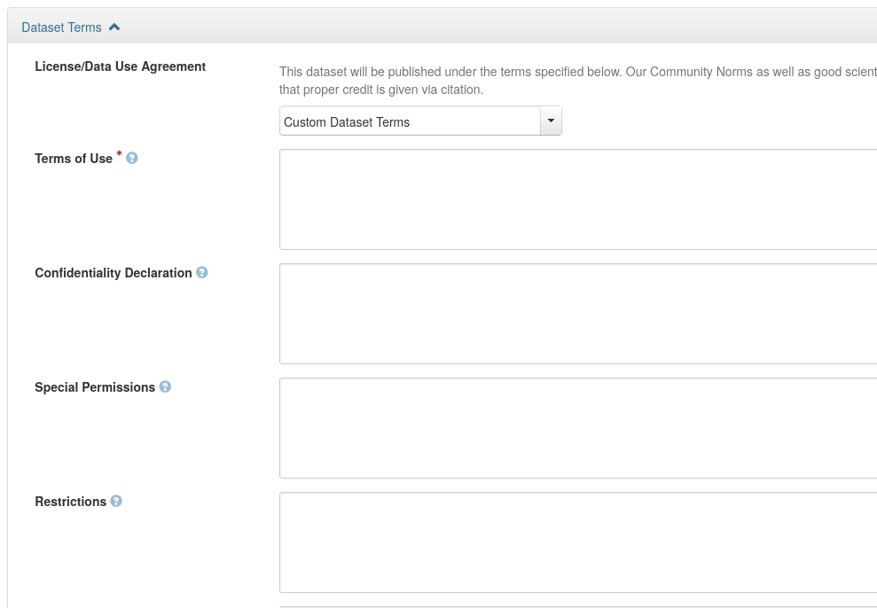

:::
::::

## Back to practical matters {.orange}

## Uploading data to Dataverse via API

- From terminal, with *Python*

```{.bash code-line-numbers="|1-2|3|4-5|6-8"}
python3 -m venv venv-dv
source venv-dv/bin/activate
source .Renviron
git clone https://github.com/larsvilhuber/dataverse-uploader
pip install -r dataverse-uploader/requirements.txt
python3 dataverse-uploader/dataverse.py \
   $DATAVERSE_TOKEN $DATAVERSE_SERVER \
   $DATAVERSE_DATASET_DOI . -d data/metadata
```

## Results locally

:::: {.columns}

::: {.column width="50%"}

```{.bash}
Connecting to Dataverse server: https://demo.dataverse.org
Dataset DOI: doi:10.70122/FK2/EMAWKA
Dataset ID: 2695588
Found 0 existing files in dataset
Deleting 0 existing files...

Paths to upload: ['./data/metadata']
```

:::
::: {.column width="50%"}

```{.bash}
Scanning path: ./data/metadata
  Directory: ./data/metadata (contains 1 files)
    Uploading [1]: ./data/metadata/data.raw.sha256
      Filename: data.raw.sha256
      Directory label: './data/metadata'
      Response status: 200

Total files uploaded: 1

Done!
```
:::
::::


## Results remotely

:::: {.columns}

::: {.column width="50%"}

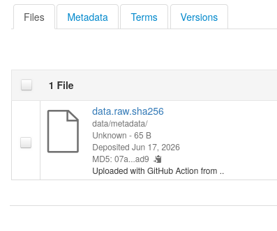

:::
::: {.column width="50%"}

- Filename is preserved
- Pathname is preserved! `data/metadata`
- MD5 checksum is also present! (less useful for the checksum file!)

:::
::::

## Automatically from Github Actions


- [Code for uploading automatically](https://github.com/labordynamicsinstitute/tutorial-preserving-survey/blob/main/.github/workflows/compile-presentation.yml#L175)

## Voilà!

We have a workflow that can automatically download from Qualtrics, and in the same move, upload to Dataverse!

Possible improvements:

- [immediately publish (no human intervention)](https://github.com/labordynamicsinstitute/tutorial-preserving-survey/blob/main/.github/workflows/compile-presentation.yml#L193)
- upload the download logs and checksums together with the data
- [run on a schedule](https://github.com/labordynamicsinstitute/tutorial-preserving-survey/blob/main/.github/workflows/compile-presentation.yml#L8)