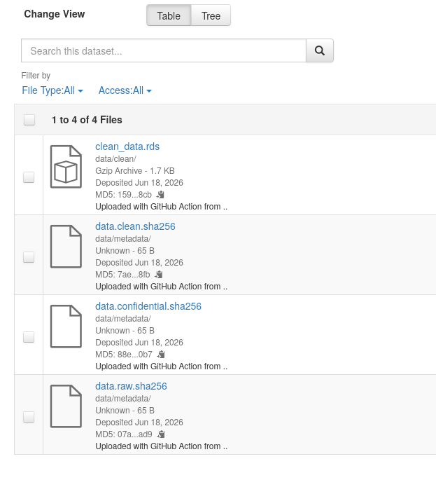

## State of the data directory

```{r data-directory, echo=TRUE, eval=TRUE}
fs::dir_tree(datapath)
```

## Uploading to Dataverse 

:::: {.columns}
::: {.column width="50%"}

```{bash upload-dataverse, eval=FALSE, echo=TRUE}
# System setup
# Need: apt install python3.10-venv
python3 -m venv venv-dv
source venv-dv/bin/activate
git clone https://github.com/larsvilhuber/dataverse-uploader
pip install -r dataverse-uploader/requirements.txt
```

:::
::: {.column width="50%"}
```{bash upload-dataverse-2, eval=FALSE, echo=TRUE}
# Do the uploads
python3 dataverse-uploader/dataverse.py \
   $DATAVERSE_TOKEN $DATAVERSE_SERVER \
   $DATAVERSE_DATASET_DOI . -d data/metadata
python3 dataverse-uploader/dataverse.py \
   $DATAVERSE_TOKEN $DATAVERSE_SERVER \
   $DATAVERSE_DATASET_DOI . \
   -d data/clean \
   --remove false
```
:::
::::

---

