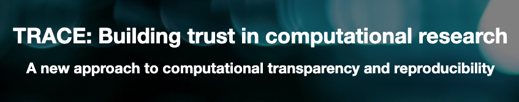
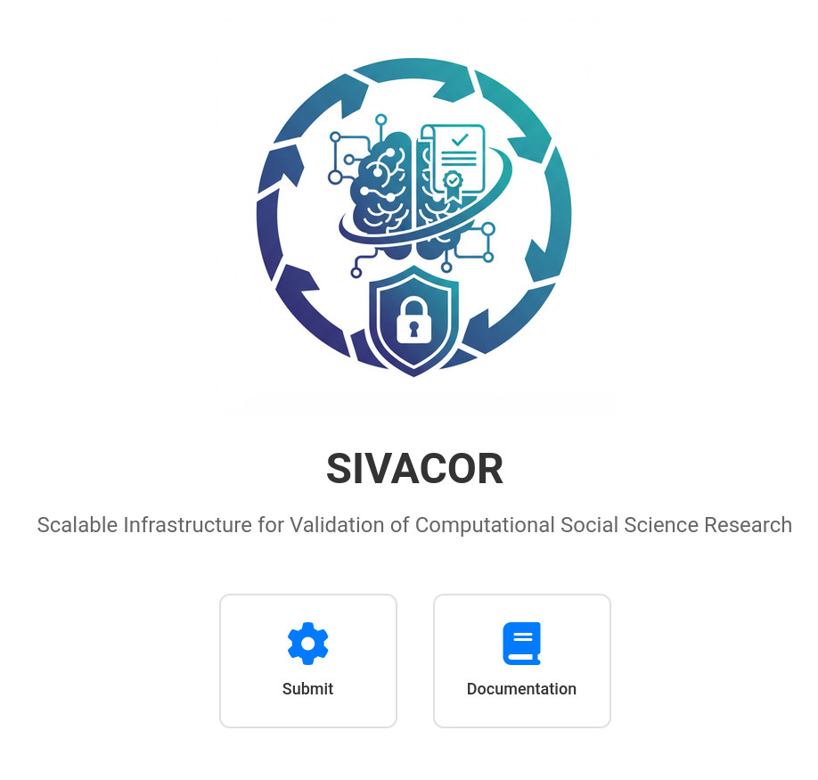

## Using 3rd-party trusted systems

## A sketch: Transparency Certified

<https://transparency-certified.github.io/>

## Work in progress

- Working with [cascad](https://www.cascad.tech/), several [INEXDA](https://inexda.org) members, World Bank, various RDCs
- Relying on external certification of data inputs (data catalogs with metadata, checksums)

## Work in progress

::::{.columns}
::: {.column width="50%}
- [SIVACOR](https://sivacor.org/): Scalable Infrastructure for Validation of Computational Social Science Research[^sivacor]

[^sivacor]: [Presentation](https://transparency-certified.github.io/trace-sivacor-presentation-2026/#/sivacor)

:::
::: {.column width="50%}

:::
::::