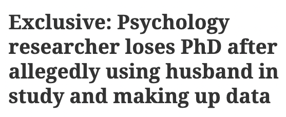
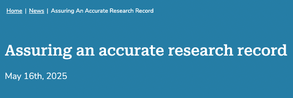

## Does not prevent all fraud

::::{.columns}
:::{.column width="50%"}

[Toronto researcher loses Ph.D.](https://retractionwatch.com/2024/04/26/psychology-researcher-loses-phd-after-allegedly-using-husband-in-study-and-making-up-data/)

:::
:::{.column width="50%"}

[MIT student makes up firm data](https://economics.mit.edu/news/assuring-accurate-research-record)

:::
::::

## Back to Gino

- A transparent, automated pipeline makes it *much harder* to manipulate data **after collection, before analysis** — exactly the Gino failure mode.
- But it does **not** prevent fabricating data at the source, or other forms of misconduct.
- Transparency and preservation raise the cost of fraud and the odds of detection — they are not a silver bullet.
